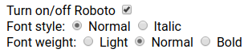

Fonts
=====

Getting fonts ready for web can be a very manual process and font bugs are very
difficult to track down. This is a step by step guide you can use to verify that
your fonts will work on firefund.net

Table Of Content
1. [Download](#Download)
1. [Verify](#Verify)
1. [Optimize](#Optimize)
1. [Web](#Web)

## Download

First we need a _source_ font so we can build our web fonts.
[Google Fonts](https://fonts.google.com/) is one of the most known places to
download free fonts from, but a lot of others exist.

This guide will focus on Google Fonts and the TrueType Font format (`.ttf`).

After you have found your font, click on the small + circle and then on "Family
Selected".

Here you can get a link to fonts.googleapis.com, which is fine for prototyping and
development but due to how fonts.googleapis.com caching strategy is implemented it
is painfully slow on bad connections like mobile phones. So instead we host fonts
our self, so users don't have to wait 10 seconds to see our pages.

Next you click on the _CUSTOMIZE_ link, where you can choose which font-weights you
want to use. Fonts are pretty big and we do not want too many weights since that can slow down our pages considerably.

Currently (Feb. 2019) we only use the Roboto font and have 3 weights in normal and
italic style.
We use 300 for light, 400 is normal and 700 for bold.
If you choose the same, Google will warn you that it will be slow. Ignore the
message, since Google Fonts is both lying about what you will download and we will
optimize the fonts in a next step.

Click on the download icon (down arrow).

Now open the `.zip` file.

As you can see, Google included the Black and Medium font variants which
**we didn't want**.

You can either unzip all files and delete `Roboto-Black.ttf`,
`Roboto-BlackItalic.ttf`, `Roboto-Medium.ttf`, and `Roboto-MediumItalic.ttf` or
just choose to extract every other file than them.

> It turns out that you get every `.ttf` file from a font with every language
> and all implemented font-features, when you press download. So we will skip a
> larger explanation about language support but just for kicks - scroll
> down to the _Languages_ section on Google Fonts, to see which languages
> Roboto supports.

The fonts hosted on Google Fonts are almost always very old and doesn't contain
all the normal font features found in the same font, had you downloaded it
from elsewhere. If we are to trust the file date of our Roboto fonts, then they
are from January 2013 (6 years old!). But Google Fonts is the easiest site to
search for fonts, that I know.

The next steps will take a lot of time, so we need to be really, **really**, sure
that our source fonts has everything we need.

## Verify

For the purpose of this guide, we will create a new folder in `fonts/`.
Let's call it `myfont`.

Now copy `index.html` and `font.css` from the `Roboto` folder into `myfont`.

```bash
cd fonts
cp -v Roboto/index.html myfont
cp -v Roboto/font.css myfont
```

The directory structure in `myfont` should now look like this:

```
myfont/
|- font.css
|- index.html
|- LICENSE.txt
|- Roboto-BoldItalic.ttf
|- Roboto-Bold.ttf
|- Roboto-Italic.ttf
|- Roboto-LightItalic.ttf
|- Roboto-Light.ttf
|- Roboto-Regular.ttf
|- Roboto-ThinItalic.ttf
|- Roboto-Thin.ttf
```

Open `index.html` in your editor and find these two lines at the top of the file:

```html
<!-- <link rel="stylesheet" href="font.css"> -->
<link rel="stylesheet" href="web/font.css">
```

Comment out the `<link>` to `"web/font.css"` and remove the comment around
`<link rel="stylesheet" href="font.css">`.

Like so:

```html
<link rel="stylesheet" href="font.css">
<!-- <link rel="stylesheet" href="web/font.css"> -->
```

To verify our fonts we need to both visually verify our letters but we also need
to see that the correct font is loaded by browsers. In Chrome you can see
network requests by just opening `index.html` and check the Network pane in
devtools but Firefox will only show you network requests if you see `index.html`
served from a web server.

Since we use `npm` for everything, we are going to install a light weight web
server that run in nodejs.

```bash
npm i -g ecstatic
ecstatic myfont
```

Now open Chrome and Firefox and go to `localhost:8000`.

Open devtools and the Network pane (in Firefox you need to check _Disable cache_).

Open `font.css` in your editor.

`font.css` maps our fonts to a `font-family` in a `@font-face` selector. There
is one `@font-face` selector for each font variation.

```css
@font-face {
  font-family: 'roboto'; /* The name we will use in our CSS */
  src: url(Roboto-Bold.ttf) format('truetype'); /* Location of our font file */
  font-style: normal; /* normal or italic (cursive) */
  font-weight: 700; /* bold = 700, normal = 400, think = 300 */
}
```
_If our font files are called something else, then we have to correct the link
to the font file._

On our test page there is a set of controls at the top.



If you click on Italic and watch your Network pane in devtools, you will see
that `Roboto-RegularItalic.ttf` is 404
([HTTP 404 means that `Roboto-RegularItalic.ttf` is not found](https://httpstatusdogs.com/404-not-found)).

The reason is that our italic font file is called `Roboto-Italic.ttf` but in
`font.css` it is called `Roboto-RegularItalic.ttf`.

```css
@font-face {
  font-family: 'roboto';
  src: url(Roboto-RegularItalic.ttf) format('truetype');
  font-style: italic;
  font-weight: 400;
}
```

You can either change the name in `src` property or rename the file. I prefer
having a similar naming convention for all files, so just as the italic version
of `Roboto-Bold.ttf` is called `Roboto-BoldItalic.ttf`, I prefer to call
`Roboto-Italic.ttf` for `Roboto-RegularItalic.ttf`.

The controls set CSS properties `font-weight` and `font-style` for all HTML.
When you change these properties, you should see that:

1. The correct font file is downloaded (will only be downloaded once)
1. That all text is changed to look how it is suppose to (Light
should be lighter than Normal etc.)

Below the horizontal ruler there is text examples in unicode. Unicode can display
every letter for all languages in the world, but our font might not have a glyph
for it. That is, **the letter will look wrong if our font does not support the letter.**
Whenever a glyph is not supported, the browser will search for it on your system.
We don't have control over which font the browser will find the correct glyph and
it **will** depend on your device. Android, Windows and macOS have different system
fonts installed, so the result will be different depending on OS and device.
Samsung might pre-install other fonts than Google etc.

Go through all of the control options and check that all characters renders similar.
If they do not, then check that the correct `.ttf` file was loaded.

**If the correct file did load, then the font does not support those characters.**

The font currently hosted on Google Fonts supports the following character sets:

+ Cyrillic (Supported by Roboto)
+ Cyrillic Extended (Supported by Roboto)
+ Greek (Supported by Roboto) _- contains only Greek math symbols_
+ Greek Extended (Supported by Roboto) _- every Greek letter_
+ Latin (Supported by all Fonts) _- US English ASCII_
+ Latin Extended (Supported by Roboto) _- european letters like æøå_
+ Vietnamese (Supported by Roboto)


## Optimize

Even with only 3 different font weights for 1 font, we still have to download
1.4MB, which is a lot of data, especially because the correct design will not
be displayed until it has loaded.

What we need is a more compact format than TrueType (`.ttf`).
The answer is `.woff`.

We can use an online webfont generator like
[Font Squirrel](https://www.fontsquirrel.com/tools/webfont-generator)
to convert our `.ttf` files to `.woff` and `.woff2`.

Click on _UPLOAD FONTS_ and choose all of our `.ttf` files. You remembered to
delete the font-weights that we do not need, right?

Check _"Yes, the fonts I'm uploading are legally eligible for web embedding"_.

We have 3 options, the default is _OPTIMAL_ which will remove everything we
need in our font and only work in US English.
**So choose _BASIC_**.

> Under _EXPERT_ there is a lot of interesting font features. But note, that
> just because a font feature exist, it does not mean that your font will
> support that feature. You have to try and have a lot of patience.
> We could set _Subsetting_ which would allow us to exclude Vietnamese
> and Cyrillic. Of special interest
> is `Tabular Numerals` which is the numbers specially designed to have equal
> width when next to each other - think a counter where you don't want the numbers
> to jump to the left and right as they change.

Click on _DOWNLOAD YOUR KIT_.
Between uploading fonts and converting them, you can make yourself a cup of coffee.
This **will** take some time.

Unzip the files to `fonts/myfont/web/`.


## Web


